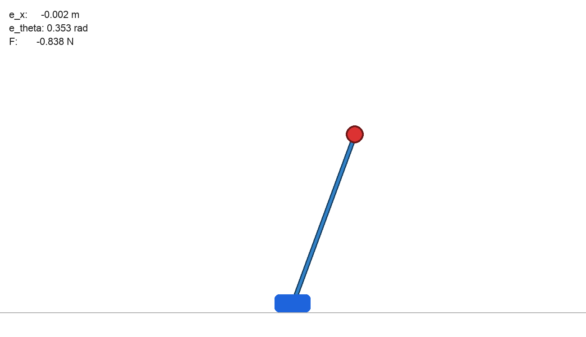
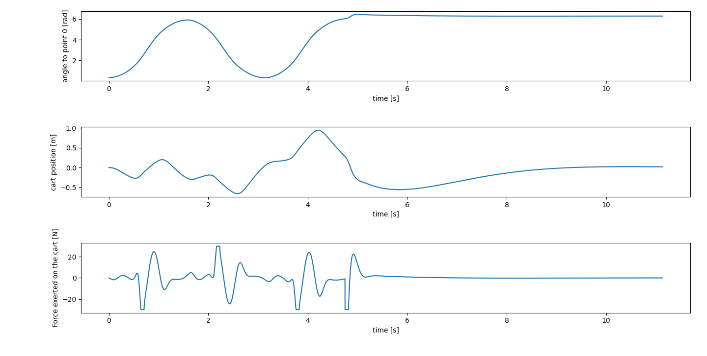

Inverted Pendulum Hybrid Control Simulation

A beginner Python simulation of a cart-pendulum system with automated parameter optimization and a dual-phase control strategy.

<table>
  <tr>
    <td width="50%">
      
    </td>
    <td width="50%">
      
    </td>
  </tr>
</table>

## Core Features
* **Hybrid Control:** Transition from energy-based swing-up control to PID stabilization (±15° equilibrium threshold).
* **Automated Optimization:** Hyperparameter tuning using `scipy.optimize` to minimize cost functions (position drift, angular error, and control effort).
* **Wizualizacja & Analytics:** Real-time physics rendering with Pygame and post simulation performance plotting using Matplotlib.

## Project Structure
* `config.py` - System constants, physical parameters, and structural constraints - feel free to experiment and see how the system behaves. 
* `physics.py` - Equations of motion and Euler integration.
* `optimization.py` - Cost function definitions and optimization.
* `main.py` - Core simulation, UI rendering, and data logging.

## Installation & Usage

1. **Install Dependencies:**
2. ```bash
   pip install pygame scipy matplotlib
